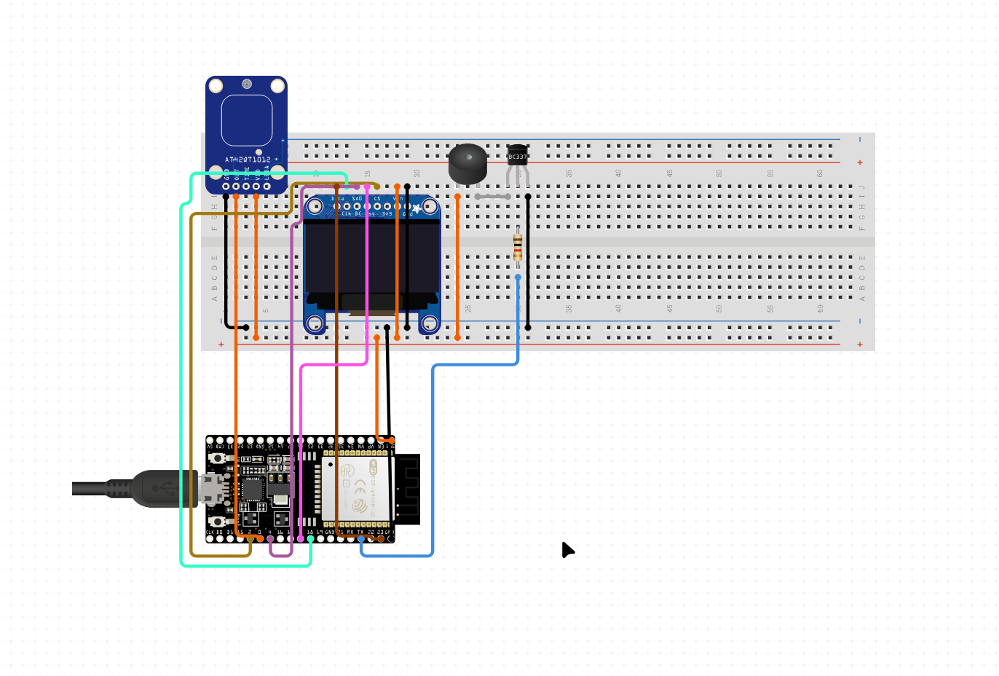

# SANGI: Autonomous Emotion Robot

[](https://github.com/umersanii/SANGI)
[](./test/)
[](#license)
[](#hardware)

**A cute, standalone robot with animated expressions, personality-driven behavior, BLE control, and touch gestures—no WiFi required.**

---

## Table of Contents

- [What is SANGI?](#what-is-sangi)
- [Features](#features)
- [Quick Start](#quick-start)
- [Hardware](#hardware)
- [Usage](#usage)
- [Architecture](#architecture)
- [Testing](#testing)
- [Configuration](#configuration)
- [Roadmap](#roadmap)
- [Contributing](#contributing)
- [License](#license)

---

## What is SANGI?

SANGI is a **fully autonomous ESP32-C3 robot** with an animated OLED face that:

- Expresses 14 different emotions with smooth animations
- Responds to touch with smart gesture recognition (tap, long-press, double-tap)
- Has personality that evolves over time based on neglect and time of day
- Works offline with optional BLE remote control
- Runs forever on battery with zero external dependencies

Perfect for a desk companion, IoT learning project, or just fun robot hacking.

---

## Features

### 14 Animated Emotions

<table>
<tr>
<td>😊 IDLE</td>
<td>😄 HAPPY</td>
<td>😴 SLEEPY</td>
<td>😲 EXCITED</td>
</tr>
<tr>
<td>😢 SAD</td>
<td>😠 ANGRY</td>
<td>🤔 THINKING</td>
<td>😕 CONFUSED</td>
</tr>
<tr>
<td>💕 LOVE</td>
<td>😲 SURPRISED</td>
<td>💀 DEAD</td>
<td>😑 BORED</td>
</tr>
<tr>
<td>😳 SHY</td>
<td>⚡ BLINK</td>
<td colspan="2"></td>
</tr>
</table>

### 🧠 Personality Engine

| Feature | Behavior |
|---------|----------|
| Attention Arc | Neglect for 5+ min → BORED → SAD → CONFUSED → ANGRY |
| Mood Drift | Every ~2 min: random emotion weighted by time of day |
| Micro-expressions | 15% chance of random blink for subtle personality |
| Touch Recovery | Touch during neglect → bashful SHY → happy recovery |
| Jittered Timing | All intervals ±20% variance for realistic behavior |

### Gesture Recognition

- TAP (< 600ms) → Shows HAPPY
- LONG PRESS (≥ 600ms) → Shows LOVE
- DOUBLE TAP (within 300ms) → Shows EXCITED

### BLE Remote Control

- Advertise as "SANGI" with NimBLE stack
- Write emotion ID (0–13) to change emotion
- Read current emotion status
- Control from nRF Connect app (iOS/Android)

### Standalone Hardware

- No network, no cloud, no internet required
- Autonomous personality cycling
- Local BLE for control
- Touch interaction
- Battery voltage monitoring
- Audio feedback via speaker

---

## Quick Start

### Prerequisites

- ESP32-C3 microcontroller
- SSD1306 OLED display (128×64, I2C)
- PlatformIO (platformio run requires PlatformIO CLI)
- USB cable for flashing and serial monitor

### Clone & Build

```bash
git clone https://github.com/umersanii/SANGI.git
cd SANGI

# Build firmware
platformio run

# Upload to device
platformio run --target upload
```

### Monitor Serial Output

```bash
platformio device monitor --port /dev/ttyUSB1 --baud 115200
```

Expected output:
```
>>> ESP32 BOOT SUCCESSFUL <<<
=== SANGI Robot Initializing ===
BLE: advertising as 'SANGI'
=== SANGI Ready! (14 emotions registered) ===
Battery: 4.15V | Emotion: IDLE | Uptime: 0s
```

### Verify It Works

- Touch the sensor → Robot shows HAPPY
- Hold for 600ms → Robot shows LOVE
- Double tap → Robot shows EXCITED

---

## Hardware

### Circuit


### Pinout

| Component | Spec | Pin Assignment |
|-----------|------|----------------|
| Microcontroller | ESP32-C3 | — |
| Display | SSD1306 OLED 128×64 (I2C) | GPIO 6 (SDA), GPIO 7 (SCL) |
| Touch Sensor | Capacitive button | GPIO 3 |
| Battery ADC | Voltage monitoring | GPIO 2 |
| Speaker | PWM beeper | GPIO 10 |

### Wiring

```
ESP32-C3 → SSD1306 OLED
GPIO 6 (SDA) → SDA
GPIO 7 (SCL) → SCL
GND → GND
3V3 → VCC

ESP32-C3 → Touch Sensor
GPIO 3 → Touch input
GND → GND

ESP32-C3 → Speaker
GPIO 10 → Positive lead
GND → Negative lead

ESP32-C3 → Battery
GPIO 2 (ADC) → Positive terminal (voltage divider recommended)
GND → Negative terminal
```

---

## Usage

### Via Touch Gestures (Default)

Simply interact with the capacitive touch sensor:

```
Quick tap (< 600ms)          → HAPPY 😄
Hold down (600ms+)           → LOVE 💕
Double tap (within 300ms)    → EXCITED 😲
Leave alone (5+ min)         → Auto-degrade: BORED → SAD → CONFUSED → ANGRY
Touch during neglect         → Recovery: SHY → HAPPY
```

### Via BLE Remote Control

1. Download nRF Connect (free, iOS/Android)
2. Scan for devices → Find "SANGI"
3. Connect to device
4. Find service `face0001-...`
5. Find characteristic `face0002-...`
6. Write emotion ID to change emotion:

```
0x00 = IDLE          0x08 = LOVE
0x01 = HAPPY         0x09 = SURPRISED
0x02 = SLEEPY        0x0A = DEAD
0x03 = EXCITED       0x0B = BORED
0x04 = SAD           0x0C = SHY
0x05 = ANGRY         0x0D = BLINK
0x06 = THINKING
0x07 = CONFUSED
```

### Via Serial Debug

When `DEBUG_MODE_ENABLED` is set, the robot displays a fixed emotion and ignores personalities.

---

## Testing

Run all 37 native unit tests (no hardware needed):

```bash
platformio test -e native
```

**Test coverage includes:**
- Emotion state transitions and registry
- Animation frame timing and caching
- Display rendering (MockCanvas)
- Gesture classification state machine
- Personality engine (attention arc, mood drift, recovery)
- BLE validation logic
- Battery monitoring

All tests pass with zero warnings.

---

## Architecture

### Core Classes

```cpp
EmotionManager      // State machine: emotion transitions with 7-frame blink
EmotionRegistry     // Registry pattern: enum → metadata + draw function
AnimationManager    // Generic frame-based animation tick engine
DisplayManager      // OLED rendering via ICanvas interface
InputManager        // Gesture detection & state tracking
BleControl          // NimBLE server with emotion control characteristic
Personality         // Attention arc, mood drift, micro-expressions, recovery
```

**Zero circular dependencies.** All modules communicate via callback injection.

### Design Patterns

- Registry Pattern — No switch statements; emotions added via `registry.add()`
- Callback Injection — `EmotionManager` decoupled from beeps, MQTT, animations
- Strategy Pattern — Draw functions registered in registry, called dynamically
- ICanvas Interface — Display abstraction for hardware (`DisplayManager`) and testing (`MockCanvas`)

### Project Structure

```
SANGI/
├── src/
│   ├── main.cpp              # Orchestration (wires modules, callbacks)
│   ├── emotion.cpp           # State machine
│   ├── emotion_registry.cpp  # Registry lookup
│   ├── emotion_draws.cpp     # 14 emotion animations (51 frames each)
│   ├── animations.cpp        # Generic frame-based ticker
│   ├── display.cpp           # OLED rendering
│   ├── battery.cpp           # ADC voltage reading
│   ├── input.cpp             # Gesture detection state machine
│   ├── speaker.cpp           # Beep pattern generation
│   ├── ble_control.cpp       # NimBLE server
│   └── personality.cpp       # Personality engine
├── include/
│   ├── config.h              # Hardware pins & timing constants
│   ├── emotion.h             # EmotionManager class
│   ├── emotion_registry.h    # Registry class
│   ├── emotion_draws.h       # Draw function declarations
│   ├── animations.h          # AnimationManager class
│   ├── display.h             # DisplayManager class
│   ├── battery.h             # BatteryManager class
│   ├── input.h               # InputManager & gesture enums
│   ├── speaker.h             # BeepManager class
│   ├── ble_control.h         # BleControl class
│   ├── canvas.h              # ICanvas interface
│   └── personality.h         # Personality engine class
├── test/
│   ├── test_sangi.cpp        # 37 unit tests
│   ├── mock_canvas.h         # Mock display for testing
│   └── arduino_stub/         # Arduino API stubs (millis, Serial, GPIO)
├── platformio.ini
├── CLAUDE.md                 # Development guide for Claude Code
└── README.md                 # This file
```

---

## Configuration

All timing and hardware config lives in `include/config.h`:

```cpp
// Gesture Timing
#define LONG_PRESS_MS 600
#define DOUBLE_TAP_WINDOW_MS 300

// Personality Timings
#define ATTENTION_STAGE1_MS 300000    // 5 min → BORED
#define ATTENTION_STAGE2_MS 600000    // 10 min → SAD
#define ATTENTION_STAGE3_MS 750000    // 12.5 min → CONFUSED
#define ATTENTION_STAGE4_MS 900000    // 15 min → ANGRY
#define MOOD_DRIFT_INTERVAL_MS 120000 // ~2 min between changes
#define MICRO_EXPRESSION_CHANCE 15    // % chance for random BLINK
#define JITTER_PERCENT 20             // ±20% variance on all timings

// Hardware Pins
#define TOUCH_PIN 3
#define SPEAKER_PIN 10
#define BATTERY_PIN 2

// Feature Flags
#define DEBUG_MODE_ENABLED 0
#define DEBUG_MODE_EMOTION EMOTION_HAPPY
#define ENABLE_EMOTION_BEEP 1
```

---

## Dependencies

```ini
adafruit/Adafruit SSD1306@^2.5.7
adafruit/Adafruit GFX Library@^1.11.3
h2zero/NimBLE-Arduino@^1.4.0
```

**Zero network, cloud, or external service dependencies.** Fully autonomous and offline-capable.

---

## Known Limitations

- No SD card logging (flash storage only)
- No WiFi or internet (intentional v1 design)
- BLE range ~10m (NimBLE at +3dBm)
- Battery monitoring is read-only (no charge cycle detection)

---

## Roadmap

## Contributing

Pull requests are welcome! Please ensure:

1. Tests pass: `platformio test -e native`
2. Code compiles: `platformio run`
3. Hardware tested: Flash and verify on device
4. No new globals: Use callbacks for decoupling
5. Registry pattern: Add emotions via registry, not switch statements

---

## License

MIT License — See [LICENSE](./LICENSE) for details.

---

## Author

**Umer Sani** ([@umersanii](https://github.com/umersanii))

- Framework: Arduino + PlatformIO
- Platform: ESP32-C3 + SSD1306 OLED
- Created: March 2026

---

**Status:** v1 Complete — Tested on hardware, all 37 tests passing.

